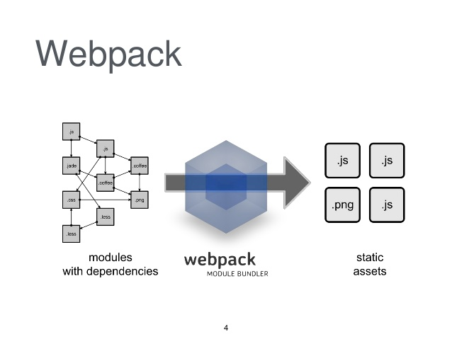

## Why Bundle

1. Optimize assets (images, svg, fonts)
2. Group multiple files into a single cachable file
3. Reduce bundle size
4. Different outputs for different environments
5. Transpile and Transform code
6. Working with modules (pre ES-modules)
   
---

## Popular bundling tools

1. Webpack
2. Rollup
3. Parcel
4. Gulp

---

## Bundeling concepts

1. Tree shaking
2. Uglify
3. Chunk splitting
4. Code transformation

---

# Webpack

---



---

## Example configuration

```javascript
const path = require( 'path' );
const webpack = require( 'webpack' );
const MiniCssExtractPlugin = require("mini-css-extract-plugin");

module.exports = ( env, options ) => {
	return {
		entry: './src/block.js',

		output: {
			path: path.resolve( __dirname, 'build' ),
			filename: 'block.js',
		},

		devtool: 'cheap-eval-source-map',

		module: {
			rules: [
				{
					test: /\.jsx$|\.es6$|\.js$/,
					use: {
						loader: 'babel-loader',
						options: {
							presets: ['react'],
						}
					},
					exclude: /(node_modules|bower_components)/
				},
				{
					test: /\.css$/,
					use: [
						MiniCssExtractPlugin.loader,
						{
							loader: 'css-loader',
							options: {
								importLoaders: 1,
								minimize: ( options.mode == 'production' ? true : false ),
								sourceMap: true,
							}
						},
						{
							loader: 'postcss-loader',
							options: {
								plugins: [ require( 'autoprefixer' ) ]
							}
						},
					],
				},
				{
					test: /\.(png|jpg|gif)$/,
					use: [
						{
							loader: 'file-loader',
							options: {
								name: '[name].[ext]',
								outputPath: 'images/'
							}
						}
					]
				},
			],
		},

		plugins: [
			new MiniCssExtractPlugin({
				filename: 'style.css',
				chunkFilename: '[id].css'
			})
		],

	}
};
```

---
## Core Concepts

- Entry
- Output
- Loaders
- Plugins
- Mode

---

## Entry

An entry point indicates which module webpack should use to begin building out its internal dependency graph

```js
module.exports = {
  entry: './path/to/my/entry/file.js'
};
```

---

## Output

Tells webpack where to emit the bundles it creates and how to name these files

```js
const path = require('path');

module.exports = {
  entry: './path/to/my/entry/file.js',
  output: {
    path: path.resolve(__dirname, 'dist'),
    filename: 'my-first-webpack.bundle.js'
  }
};
```

---

## Loaders

- Out of the box, webpack only understands `JavaScript` and `JSON` files.

- Loaders allow webpack to process other types of files and convert them into valid modules that can be consumed by your application and added to the dependency graph.

```js
module.exports = {
  output: {
    filename: 'my-first-webpack.bundle.js'
  },
  module: {
    rules: [
      { test: /\.txt$/, use: 'raw-loader' }
    ]
  }
};
```
---

## Plugins

Plugins can perform a wide range of tasks like `bundle optimization`, `asset management` and `injection of environment variables`.

```js
const HtmlWebpackPlugin = require('html-webpack-plugin'); //installed via npm
const webpack = require('webpack'); //to access built-in plugins

module.exports = {
  module: {
    rules: [
      { test: /\.txt$/, use: 'raw-loader' }
    ]
  },
  plugins: [
    new HtmlWebpackPlugin({template: './src/index.html'})
  ]
};
```

- [Built in Plugins >](https://webpack.js.org/plugins/)
- [More Plugins >](https://github.com/webpack-contrib/awesome-webpack#webpack-plugins)

---

## Mode

```js
module.exports = {
  mode: 'production'
};

```
> By setting the mode parameter to either `development`, `production` or `none`, you can enable webpack's built-in optimizations that correspond to each environment. The default value is `production`

---

# Practice

---

## Installing webpack

```sh
yarn init

yarn add -D webpack webpack-cli

yarn add lodash
```

---

create code (index.html + index.js)

```sh
npx webpack
```

----

## Configuration File

`webpack.config.js`

```javascript
const path = require('path');

module.exports = {
  entry: './src/index.js',
  output: {
    filename: 'main.js',
    path: path.resolve(__dirname, 'dist'),
  },
};
```

```sh
npx webpack --config webpack.config.js
```

---

# Assat Management

---

```sh
yarn add --D style-loader css-loader
```

```javascript
const path = require('path');

  module.exports = {
    entry: './src/index.js',
    output: {
      filename: 'bundle.js',
      path: path.resolve(__dirname, 'dist'),
    },
+   module: {
+     rules: [
+       {
+         test: /\.css$/,
+         use: [
+           'style-loader',
+           'css-loader',
+         ],
+       },
+     ],
+   },
  };
```
---

# Rollup

---

Learn by example

```
git@github.com:rollup/rollup-starter-lib.git
```


